# NMS Galactic Map

A fan-made *No Man's Sky* tool built on one fact the game never spells out: a
12-glyph portal address is not an opaque code, it's a 3D coordinate. Decode
it and you're not reading a string — you're pointing at an exact voxel in a
4096 x 256 x 4096 grid that spans the whole galaxy. So the portal decoder and
the galaxy map are the same tool: type or tap an address, and you fly
straight to that point, in three dimensions, in a browser.

**Live site:** [nms-galaxy-map.netlify.app](https://nms-galaxy-map.netlify.app)

> Fan-made, built on public wiki data and reverse-engineered address maths.
> Not affiliated with, sponsored by, or endorsed by Hello Games.

```
portal address  ->  12 hex glyphs  ->  signed 3D voxel coordinate
                                              |
                              seeded generator (same address, same system, always)
                                              |
                          galaxy view  ->  local slice  ->  system view
                                                                  |
                                                   Edit system (optional, per visitor)
                                                                  |
                                                   Netlify Function -> filter -> GitHub commit
                                                                  |
                                          data/overrides.json (lives only on GitHub, see below)
```

**Contents**

- [What can this map do?](#what-can-this-map-do)
- [How does a portal address become a 3D location?](#the-address-decoded)
- [What files make up this repo, and what's deliberately not in here?](#whats-in-here-and-whats-not)
- [What real No Man's Sky data does this use?](#real-game-data-nms-core)
- [Can I import my own save file, and is it uploaded anywhere?](#importing-your-own-save-optional-client-side-only)
- [How do shared community edits get submitted and accepted?](#shared-community-edits-and-how-a-submission-actually-gets-in)
- [How do I run this locally?](#running-it-locally)
- [How can I verify the generator's accuracy myself?](#verifying-the-generator-yourself)
- [Is it accessible?](#is-it-accessible)
- [Credits](#credits)

## What can this map do?

Screenshots from the live site, in the order you'd actually hit them. The
site itself also has a live version of this same walkthrough -- hit **Tour**
in the toolbar (or "Take a quick tour" on the first-visit disclaimer) for a
9-step guided spotlight over the real UI instead of static images.

**Galaxy view.** Every one of the 256 real galaxies rendered as a proper 3D
spiral, colour-matched to its actual type (Normal / Harsh / Empty / Lush) --
not a static image, a real navigable scene you fly through. Switch galaxies
from the toolbar dropdown, or jump straight to one by number or name via the
searchable picker next to the glyph keypad -- galaxy isn't optional metadata
here, it's part of the address: the same 12 hex glyphs decode to a different
real system in each of the 256, so a portal address alone never fully
identifies a system without it (see [Shared community
edits](#shared-community-edits-and-how-a-submission-actually-gets-in) below).

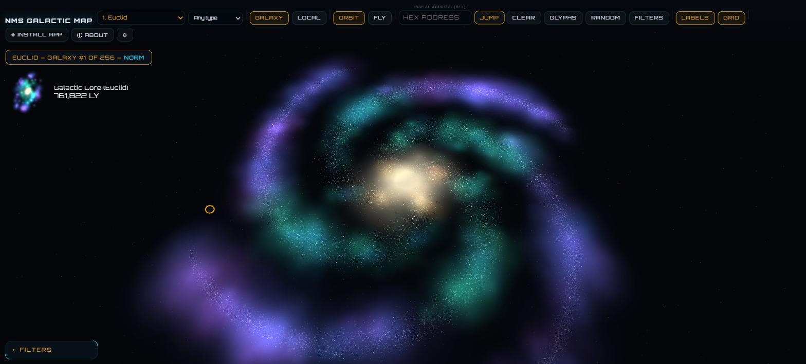

**Starting position.** A first-ever visit lands on a random spot roughly
700,000-750,000 ly from the galactic core in Euclid -- matching where a
fresh No Man's Sky save actually starts, not a fixed placeholder address
(the map's own theoretical edge-of-galaxy distance works out to ~1,159,656
ly, matching the real game's own maximum almost exactly, so the random
range sits realistically inside it rather than near the edge). It isn't
tied to your real save, just a reasonable place to start exploring from.
Once you jump anywhere for real -- typing an address, Random, a Search
result, Set course, etc. -- the map remembers that position and which of
the 257 galaxies you were in, in your own browser's local storage only
(never sent anywhere), so coming back later picks up exactly where you
left off instead of restarting in Euclid every time.  That position is marked in Galaxy
view by a pulsing gold ring -- click or tap it to drop straight into Local
view at that system, rather than only being able to switch views from the
toolbar.

**Galactic Atlas overlay.** Toggle **Atlas** in the Galaxy-view toolbar to
overlay the real points of interest from Hello Games' own [Galactic
Atlas](https://galacticatlas.nomanssky.com/) website -- Euclid galaxy only,
around 50 community-featured regions and planets, hand-entered once into
`atlas-pois.json` rather than scraped live (see
[`nms-tools/check-atlas-updates.mjs`](nms-tools/README.md#check-atlas-updatesmjs)
for how to check whether that list has drifted from the live site). Each
one decodes with this project's own address maths and renders as a diamond
marker that orbits with the galaxy exactly like the gold ring above --
click one to open its real Atlas page in a new tab. Points that sit close
together on screen collapse into a single numbered marker until you zoom
in far enough to tell them apart, matching how the official Atlas site's
own map behaves.

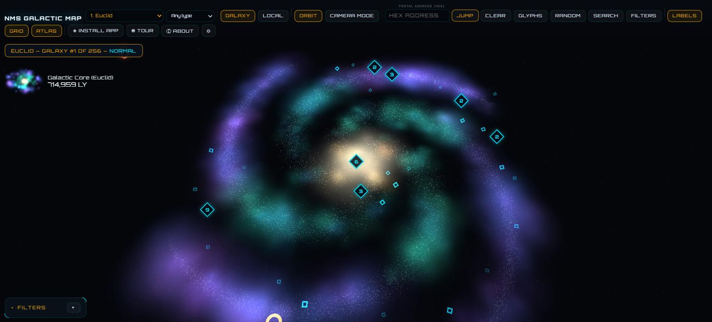

**Local view.** Zoom into a galaxy and the real star field appears --
thousands of systems, coloured by spectral class, named and clickable.
Selecting one opens the info panel on the right: race, economy (with real
sell/buy percentages), conflict level, star count, and every planet/moon in
the system. Hovering a star (desktop only) shows a lighter zoom-aware
popup first -- name only from a distance, full stats once you're in close --
and clicking any star auto-plots a course to it, replacing whatever was
plotted before.

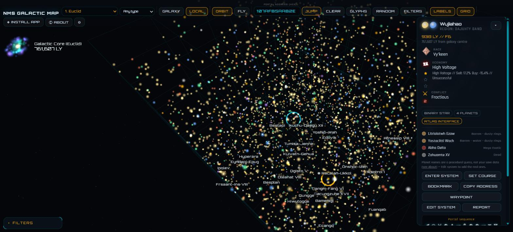

**Course lines, styled like the real game.** Solid means one jump gets you
there, dashed means it's a multi-hop route, red-dashed means your current
hyperdrive can't reach that star's colour at all. Just hovering any star
(no need to select one first) draws a quick preview line before you commit
to a course.

**Warp Manifest.** Click **Plotted course** on a selected system and it does
two things at once: draws the route line above, and opens the Warp Manifest
-- the full jump-by-jump itinerary behind that line, not just the summary
card's totals. Every stop is real: START, HOP 1, HOP 2 ... DESTINATION, each
with the actual system name and portal address the route passes through --
a hyperdrive in No Man's Sky can only ever warp to a real charted star,
never empty space, so neither does this. Click any row to open that
system's full info panel (race, economy, planets, everything) without
losing your place -- a "back to [target]" link one click above the panel
returns you to the system you were actually navigating toward. Total Jumps
and Est. Distance sit at the top of the manifest, COPY STEPS copies the
whole itinerary as plain text, and Jump to / Clear on the Course plotted
card commit to the route or cancel it. Click Plotted course again on the
same target to close the manifest without re-plotting; pick a different
target and it plots fresh and reopens automatically. Like every other panel
here, it's draggable by its header and collapsible with the small arrow
button.

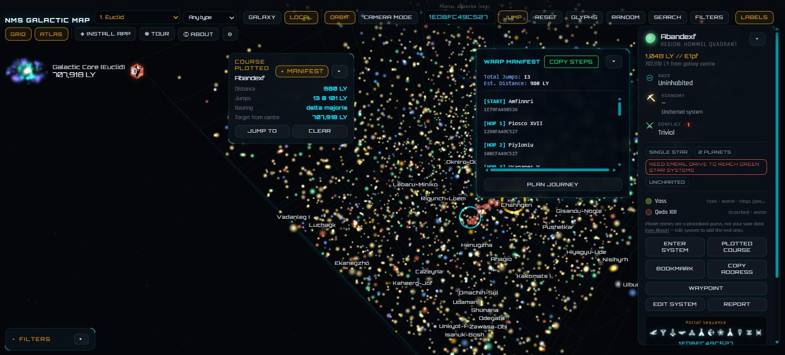

**Galactic Navigator.** **PLAN JOURNEY** on the Warp Manifest card takes
you to a separate page -- the Galactic Navigator -- in this same tab (no
second window), handing off the real plotted route: every hop's real name,
portal address, region, star type, race, economy and conflict level,
straight from the same address-decoding this map uses everywhere else, not
invented for the handoff. Close the tab or come back another day and it
picks the journey back up right where you left it -- saved on this device
the same way bookmarks and waypoints are. One piece is still a simplified
preview rather than a finished feature: confirming a real black-hole exit
inserts that detour and resumes toward the originally planned next stop,
rather than recalculating a whole new multi-hop route through the rest of
your journey. The exit candidates themselves are real, though (2026-08-30):
generated live from `nms-core` -- the same generator this map uses
everywhere else -- centred on the black hole's own real region, not a
fixed sample cluster unrelated to your actual route.

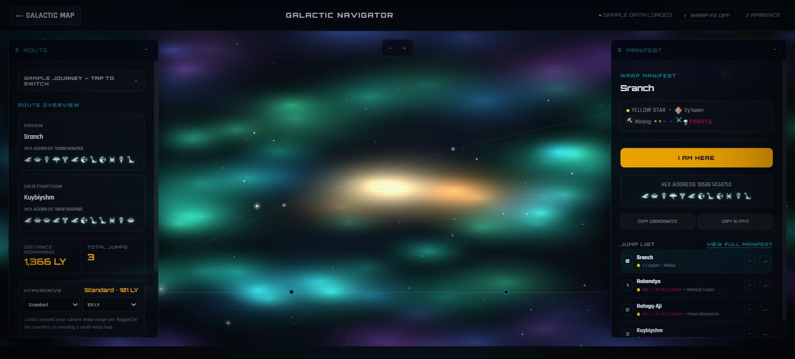

**Saved & shareable routes.** Once a course is plotted, the Course plotted
card gets two more buttons below Jump to / Clear. **Save Route** stores
that exact route into **My Routes** (the Routes button in the toolbar) so
it's there on this device even after closing the tab -- expeditions rarely
get planned start-to-finish in one sitting. **Copy Link** hands the same
route out as a URL instead, for pasting to yourself on another device or
sending to someone else -- opening it loads (and saves) the route
automatically, or paste one into the box at the top of My Routes without
needing the link to open on its own. Saved routes travel with Export/Import
logs the same way bookmarks and waypoints do.

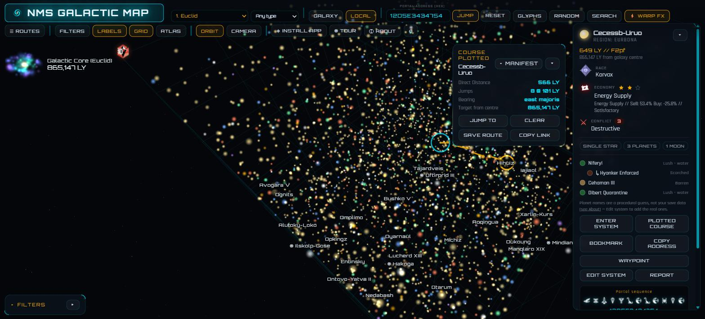

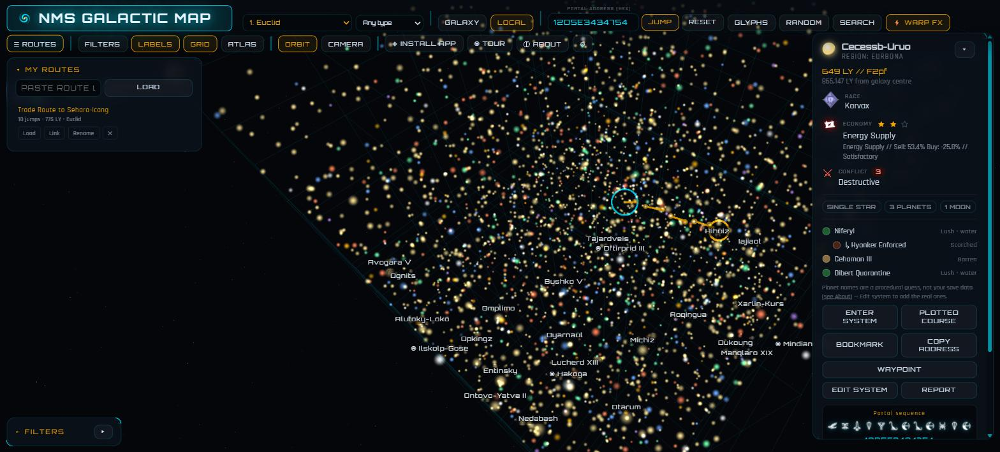

**Enter system.** Fly into any system for a true 3D orbital view -- binary
and ternary stars, planets and moons on real orbits with rings where the
generator rolled them, and (where the region has one) a black hole or Atlas
Interface rendered as its own object rather than swapped in for the star.

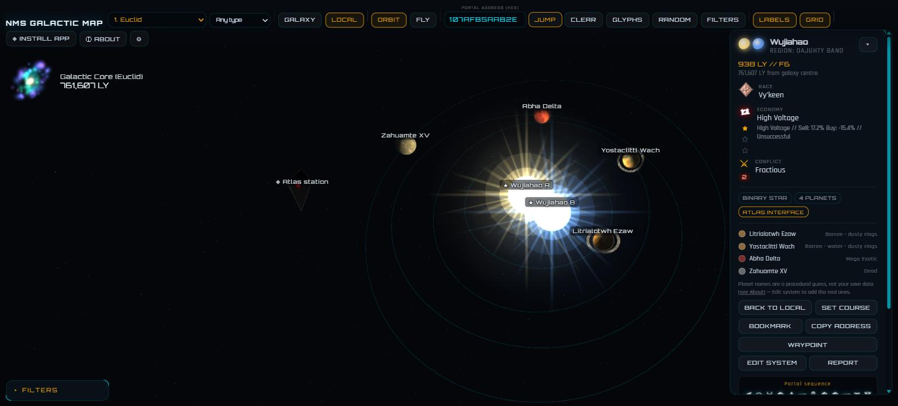

**Filters.** Narrow the local star field by colour, race, economy, or special
system types (outlaw, black holes, Atlas interfaces, phantom/shadow stars),
plus a hyperdrive type + range setting that actually gates what you can
reach -- Plotted course and Enter system both check it. There's no
"Visited" or "Edited by traveller" filter option here (removed 2026-08-27)
-- Local view is inherently a spatial sweep of whatever's currently loaded
nearby, so a filter here could never surface something on the other side of
the galaxy no matter how it worked. For a complete list of everywhere
you've ever bookmarked, waypointed, visited, or edited, regardless of where
you currently are, use Search with an empty query instead (see "Search by
name" below) -- that's the actual way back to it.

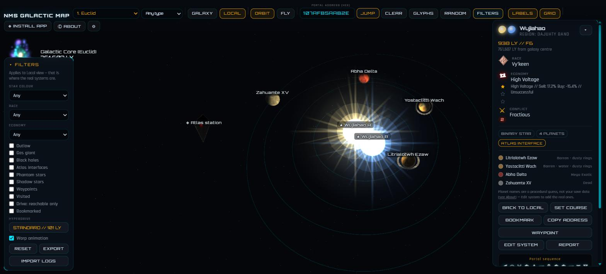

**Edit system.** Every system starts as a plausible procedural guess. Edit
system lets you overwrite that with what you actually see in-game -- stars,
race, economy, conflict, per-planet biomes and rings -- and the result is
visible to every visitor, not just saved locally. Every edit is a real git
commit, so nothing is ever silently lost. Biome and resource fields (added
2026-08-26) offer a fuller, wiki-researched dropdown -- Biome now includes
**Water World** and fixes a couple of naming gaps (e.g. Airless/Icebound) --
with room to type your own value if what you're seeing in-game isn't listed.
Resources and Minerals were renamed **Common resources** / **Uncommon
resources** to match the wiki's own rarity split, and the same
dropdown-plus-your-own-value treatment now covers Salvageable tech and
Fossils & curiosities too. An optional **screenshot** (added 2026-09-01, resized
and compressed automatically) sits alongside the public notes field --
visible to every visitor, same as everything else here -- and your own
private Surveyor notes can carry a screenshot too, saved only to your own
device.

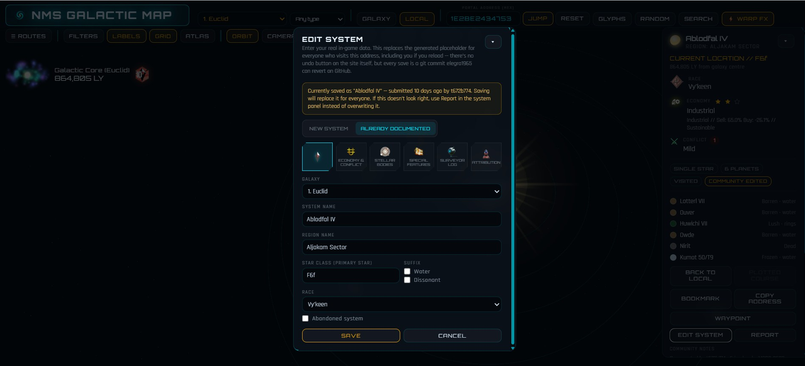

Once saved, both show up right in the system info panel for every visitor
-- **Community notes** and **Screenshot** as two clearly separate,
titled sections, so it's obvious which is which even when only one of them
has been filled in.

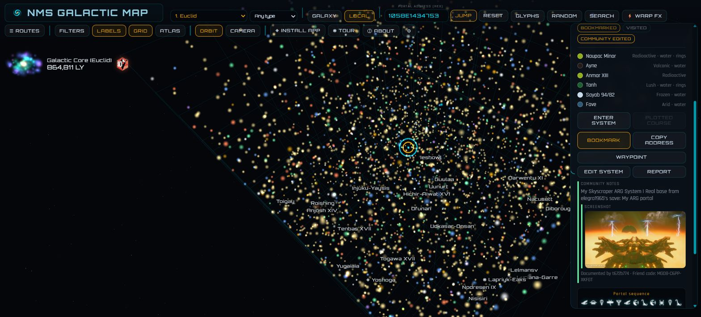

**Import from my save file.** Inside Edit system, an optional button reads a
real Steam/GOG `.hg` save file entirely in your own browser -- nothing is
ever uploaded -- and can auto-fill "Your name" plus offer a one-click
bulk-import of your real base names/addresses into the shared map. Discovery
records don't store player-given planet names at all, only base names do
(confirmed against a real save file), so that's the one thing this can
recover automatically; everything else still needs typing in by hand.

**Portal glyph keypad.** Type a hex address or tap the real 16 in-game glyphs
directly -- both stay in sync, so you can decode a screenshot from your own
game without knowing the hex first.

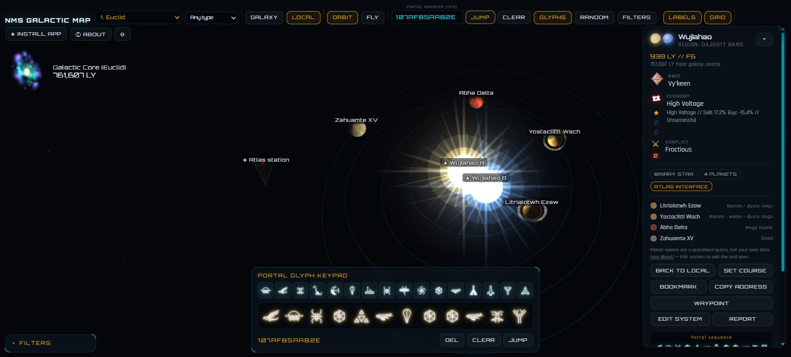

**Search by name.** No reverse index exists across the whole procedural
galaxy -- names are generated *from* the address, not the other way round --
but the Search button finds anything this browser already knows a real name
for: community-documented systems, plus your own bookmarks, waypoints, and
visited history. Results are galaxy-aware -- each one is tagged with the real
galaxy it belongs to, since the same address means something different in
each of the 256 -- and picking one switches you to that galaxy automatically
before jumping there. Leave the search box empty and it instead lists
everywhere you've bookmarked, waypointed, or visited, plus any system you
personally have edited or bulk-imported from your save (added 2026-08-27,
tagged "Documented (you)" -- other travellers' edits stay out), sorted
alphabetically -- a way to get back to somewhere you've been without needing
to remember its address or portal glyphs.

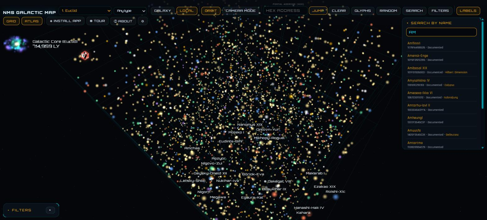

**Honest about its limits.** The About modal spells out exactly what's
generated accurately (star type, system/region names, planet count) versus
an unverified guess (individual planet names, and why) -- rather than
presenting a guess as fact.

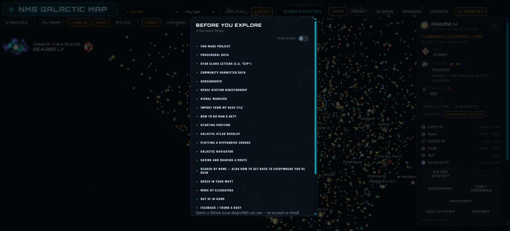

**Accessibility.** Four font-size presets, a high-contrast mode, and real
Daltonization colour-correction (not simulation) for protanopia, deuteranopia,
and tritanopia -- built into the map itself, not bolted on as an afterthought.

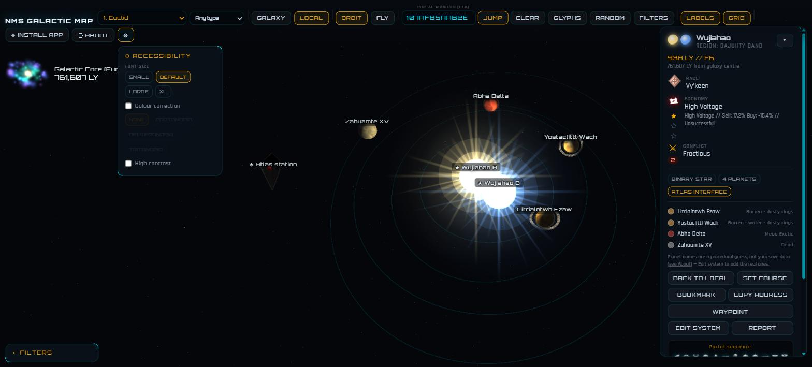

**Draggable panels.** Filters, the system info panel, Course plotted, the
Warp Manifest, the glyph keypad, Search, Edit system, and Accessibility can
all be dragged by
their header to wherever suits your screen -- handy on smaller or rotated
phones where they'd otherwise overlap, or just to pull a card off the course
line it's sitting on.

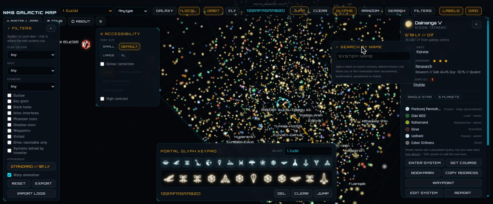

**Jump failed (custom 404).** Follow a stale link, a mistyped address, or
one that was cut off mid-share, and you don't land on a generic browser
error -- the map's own hyperdrive-fault screen picks it up instead, in the
same visual language as the rest of the site, with a way back to the map or
to Search. Every real share link on this site (Copy Link, saved routes, the
Navigator hand-off) carries its portal address in the URL's query string,
so when a broken link still has one, the page recovers it and shows the hex
code alongside its glyph strip -- covering both players who read addresses
as hex and players who read them as glyphs. When there's no address to
recover, it says so plainly instead of guessing.

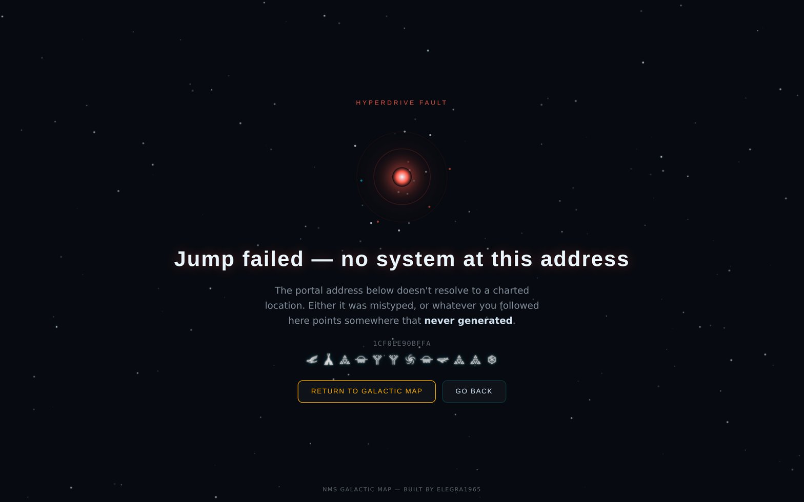

<details id="the-address-decoded">
<summary><strong>How does a portal address become a 3D location?</strong></summary>

```
[P][SSS][YY][ZZZ][XXX]     12 hex glyphs
 |   |    |   |    |
 |   |    |   |    +-- X (length)   001-FFF
 |   |    |   +------- Z (width)    001-FFF
 |   |    +----------- Y (height)   01-FF
 |   +---------------- Solar System Index   000-FFE
 +-------------------- Planet Index   0-6
```

Y, Z, and X are two's-complement, but the game skips the exact midpoint value
rather than using it (`0x80` for Y, `0x800` for X/Z) — a detail that's easy to
get subtly wrong and easy to verify against the wiki once you know to look
for it:

```js
// size = 0x100 for Y, 0x1000 for X/Z
const signed = v < size / 2 ? v : v - size;   // 0x801 -> -2047, 0x7FF -> +2047
```

Black hole and Atlas Interface placement isn't a fixed index — it follows
the real game's own distance-from-galactic-centre model (ported into
`nms-core/region.js`'s `voxelAttributes()`), not a guess. In practice that
model resolves to Solar System Index `079` being a black hole and `07A` an
Atlas Interface in almost every 400ly-wide region, which is why earlier
builds of this map just hardcoded those two indices — but the roughly
8-voxel dead core at the exact centre of the galaxy has genuinely **neither**,
and that's only correctly reproduced once `nms-core` is loaded (the
hardcoded `079`/`07A` pair is kept only as a fallback for the rare case the
module fails to load). Every other system in a region — star colour,
spectral class, race, economy, conflict level, up to six planets/moons with
real biomes, rings, and resources — is generated by seeding a PRNG off the
address itself. Same address in, same system out, every time, on every
visitor's device, with nothing stored server-side. `SPEC.md` has the
original derivation, sourced from the NMS wiki, with citations; `nms-core/`
(see below) later replaced the star-type/planet-count/placement/naming part
of that with an actual ported decompilation of the game's own logic.

</details>

<details id="whats-in-here-and-whats-not">
<summary><strong>What files make up this repo, and what's deliberately not in here?</strong></summary>

This repo is the whole client — one HTML file, no build step, no framework:

```
preview.html                      the entire app: markup + CSS + JS + Three.js r128 (cdnjs), inline
atlas-pois.json                   Galactic Atlas overlay data -- ~50 real points of interest
                                  from galacticatlas.nomanssky.com, hand-entered (name,
                                  address, url); fetched by preview.html's Atlas toggle
netlify.toml                      serves preview.html at "/", points Netlify at netlify/functions
netlify/functions/
  system-edit.mjs                 edit/report intake: rate-limits by IP, reads-merges-commits
                                  data/overrides.json via the GitHub Contents API; flagged/
                                  disputed fields go through consensus voting instead of a
                                  direct overwrite (see "Edit tracking & disputes" below)
  flag-dispute.mjs                "Data looks wrong" submissions from the Report modal —
                                  marks a field disputed, best-effort opens a GitHub Issue
  sweep-stale-flags.mjs           scheduled function, auto-clears any flag >7 days old with
                                  no consensus reached; never touches a confirmed dispute
  lib/shared.mjs                  shared GitHub Contents API read/write + GET cache used by
                                  the three functions above
  filter.mjs                      the authoritative content filter (profanity, HTML/URL
                                  stripping, per-field length + allowlist) — mirrored client-
                                  side in preview.html for instant feedback, but this copy is
                                  the one that actually decides
nms-core/                         real decompiled game logic (star type, planet count, black
                                  hole/Atlas placement, system/region/planet names, economy/
                                  conflict/race/ring odds) — see "Real game data" below and
                                  nms-core/README.md for the full module docs
nms-core/save-import/             client-side-only reader for real .hg save files (name + real
                                  base list) — see nms-core/save-import/README.md
nms-tools/                        nms-lookup.js, a single-call wrapper around nms-core for
                                  other NMS developers who don't want to learn its internals;
                                  check-atlas-updates.mjs, a manual (not scheduled) check for
                                  whether atlas-pois.json above has drifted from the live site
glyphs/                           the 16 real portal glyph PNGs (keypad)
icons-web/, Icons/                race/economy iconography, cropped from real screenshots
favicon/, manifest.json, sw.js    PWA install + offline support
navigator/                        the Galactic Navigator -- index.html, complete.html,
                                  map-mock.html; opened from preview.html's PLAN JOURNEY button
                                  with the real plotted route; see "What it can do" above
SPEC.md                           the original address maths and game-data model, wiki-sourced
SHARED-EDITS-SETUP.md             one-time GitHub token + Netlify env var setup
HANDOVER.md                       full build history, session by session
```

What's **not** in here: `data/overrides.json`, the file that actually holds
every community-submitted system edit. It isn't missing by accident — it's
never written by hand, and never present in a local working copy. The only
thing that writes it is `system-edit.mjs`'s own commit to the GitHub Contents
API, triggered by a real visitor's Edit-system submission passing the filter.
Nothing else touches it. That means there's no local copy to accidentally
push over the live one: the working tree literally has nothing there to
stage. If you ever do see a `data/overrides.json` sitting in a checkout,
delete it before committing rather than letting it go up — it can only ever
be a stale snapshot, and pushing it would overwrite real player-submitted
data with whatever was on disk at clone time.

</details>

<details id="real-game-data-nms-core">
<summary><strong>What real No Man's Sky data does this use?</strong></summary>

The procedural layer described above started as a from-scratch reverse
engineering (see `SPEC.md`). `nms-core/` replaced the star-type, planet-count,
black-hole/Atlas-placement, and system/region/planet-naming part of that with
an actual **ported decompilation** of the game's own logic — a JavaScript
port of [hadsh/nms_namegen](https://github.com/hadsh/nms_namegen) (a fork of
[Stuart Coyle's](https://github.com/stu-/nms_namegen) original work,
co-authored with GoodGuysFree), corpus-verified against real in-game names
rather than approximated. `nms-core/economy.js` is separate original work —
the economy/conflict/race/outlaw/ring logic `nms_namegen` never modelled,
decompiled from a legitimately-owned game install (see
[`nms-core/README.md`](nms-core/README.md) and [`LICENSE`](LICENSE) for the
attribution split between ported and original code). One known, disclosed
limitation: planet names are a plausible but *unverified* guess even in the
upstream library — star type, region names, and system names were validated
against a real corpus, planet names weren't (this is surfaced to players
directly, see the About modal and the hint under every system's planet
list).

**Updated 2026-08-23** against a newer release of the same upstream library, which fixed three real bugs in this project's own port (an off-by-one on the safe-start-planet draw, a missing signed-coordinate fold in black-hole/Atlas placement that affected roughly half of all voxels, and a desynced RNG stream on purple/gas-giant systems) and added a genuinely new capability: `nms-core/system.js` now derives real economy type, wealth, conflict level, and dominant race directly from the game's own generator — the actual reverse-engineered algorithm, not `economy.js`'s statistically-approximated word pools — validated against 1000 real, wiki-documented systems to 98–99% accuracy per field. This isn't wired into the live site's economy/race/conflict display yet (still `economy.js`, via a separate RNG stream — see `TODO.md`), but the star-type/planet-count/black-hole/Atlas-placement fixes are live for every visitor.

`nms-tools/nms-lookup.js` wraps the whole module behind one call —
`await init('./nms-core')` then `getSystem(address, galaxy)` — for anyone
who wants game-accurate system data in their own project without learning
`nms-core`'s internal structure first.

</details>

<details id="importing-your-own-save-optional-client-side-only">
<summary><strong>Can I import my own save file, and is it uploaded anywhere?</strong></summary>

`nms-core/save-import/` is a separate concern from the procedural layer
above — it doesn't generate anything, it *reads* a real Steam/GOG `.hg`
save file the visitor already has, entirely in their own browser (a
hand-written LZ4 block decompressor + the real obfuscated-key mapping
table from [oxur/nms-copilot](https://github.com/oxur/nms-copilot)). The
raw file is never uploaded. It can recover the traveller's own in-game
name and their real base names + addresses — but not individual planet
names, which (confirmed against a real save) aren't stored in discovery
records at all, only base names are. Reachable from **Edit system** →
"Import from my save file"; see
[`nms-core/save-import/README.md`](nms-core/save-import/README.md) for
the technical writeup.

</details>

<details id="shared-community-edits-and-how-a-submission-actually-gets-in">
<summary><strong>How do shared community edits get submitted and accepted?</strong></summary>

The procedural layer is complete on its own — every system has plausible
data the moment you jump to it. But it's still a guess. **Edit system** lets
anyone overwrite that guess with what they actually see in-game, and the
result is visible to every visitor, not just the one who typed it:

```
Edit system form
      |  POST { action:"edit", address, galaxy, payload }
      v
system-edit.mjs
      |  1. rate-limit by IP (8 edits / 15 reports per hour, tracked in the
      |     same JSON file since Functions are stateless between cold starts)
      |  2. filter.mjs runs on the payload — this is the authoritative pass,
      |     independent of whatever the client already filtered
      |  3. GET current data/overrides.json from GitHub (Contents API)
      |  4. merge the edit in, keyed by galaxy:address (a bare portal address
      |     isn't unique — the same 12 hex glyphs decode to a different real
      |     system in each of the 256 galaxies, so the store keys on the pair)
      |  5. PUT the updated file back to GitHub
      v
one new git commit = the entire revert history, free, on github.com
```

Every visitor's page load does its own `GET` against the same endpoint and
merges the result over the procedural defaults, so a submitted system stays
correct even for someone who never touches Edit system. Server field
allowlisting is explicit and by name (`filter.mjs` lists every permitted
field on a body, e.g. rings never apply to moons — enforced there, not just
hidden in the UI), so a client that tried to sneak in an unlisted field would
just have it silently dropped, not accepted. `galaxy` itself is validated the
same way (an integer 0–255) rather than trusted blindly from the client.

**Seeded from a public corpus, 2026-08-23.** 1000 of the records in `data/overrides.json` weren't typed in by a visitor — they were bulk-imported from a public, wiki-documented ground-truth corpus (`nms-systems-ground-truth-2026-08-23.json`, compiled by hadsh/nms_namegen from the NMS Fandom wiki), used here to seed real star class/water/dissonant/black-hole/economy/conflict/race data for 1000 systems nobody had visited yet. Each of those records is honest about its own provenance rather than pretending to be a personal submission: `editorName` reads "Added -- no original editor name available", and `notes` cites the exact wiki page/URL it came from, with an open invite for the real documenter (or you) to claim it properly via Edit system. Only fields the corpus genuinely documents and this form actually supports were written — no system/region names, no planet/moon counts, nothing guessed.

**Edit tracking & disputes.** Every field on a system carries a gold/green/
amber/red status — gold and green are computed client-side on the fly by
diffing the live system against a fresh procedural regeneration of the same
address (no server bookkeeping needed, and it works retroactively on edits
made before this existed); amber/red come from the Report modal's "Data
looks wrong" flow, which POSTs to `flag-dispute.mjs`. A flagged field isn't
just overwritten by the next submission — `system-edit.mjs` records it as a
vote instead, and two or more *different* editors agreeing auto-resolves the
flag and clears it. `sweep-stale-flags.mjs` runs daily and clears anything
left unresolved after 7 days without touching a genuine confirmed dispute.
An admin-only queue at `?admin=<ADMIN_TOKEN>` (never linked from the normal
UI) can confirm, dismiss, or directly fix a disputed field.

</details>

<details id="running-it-locally">
<summary><strong>How do I run this locally?</strong></summary>

No build step, no dependencies:

```bash
python3 -m http.server 8080
```

That's the whole procedural map, fully working, offline. Edit system and
Report need the two Functions running, which needs the Netlify CLI and two
environment variables:

```bash
npm install -g netlify-cli
netlify dev
```

| Variable | What it's for |
|---|---|
| `GITHUB_TOKEN` | Fine-grained PAT, **Contents: read/write**, scoped to this repo only |
| `ADMIN_TOKEN` | Optional — `?token=<value>` on the Function's GET reveals the reports queue |

Full walkthrough (creating the token, wiring Netlify to GitHub) is in
[`SHARED-EDITS-SETUP.md`](SHARED-EDITS-SETUP.md). Deployed here via Netlify,
auto-deploying on push to `main`.

</details>

<details id="verifying-the-generator-yourself">
<summary><strong>How can I verify the generator's accuracy myself?</strong></summary>

Determinism is the whole basis of the procedural layer, and it's directly
checkable — no black box:

1. Jump to any address, note the system's race/economy/conflict.
2. Reload the page, jump to the same address again.
3. Same system, byte for byte. If it isn't, that's a real bug.

Rings only ever appear on planets, never moons (checked server-side in
`filter.mjs`, not just client-side); black hole and Atlas Interface follow
the real per-region distance model described above rather than a fixed
index; ring style is derived from a planet's biome, not stored as free text,
so a manually-edited planet and a procedurally generated one of the same
biome can never disagree on what their rings look like. The one thing that
*won't* verify cleanly against your own save: individual planet names, per
the known `nms-core` limitation noted above — everything else (star type,
system/region name, planet count, economy/conflict/race) should match.

</details>

## Is it accessible?

Font size (4 presets), a High Contrast toggle, and colour-blindness support
for protanopia/deuteranopia/tritanopia — built as real Daltonization
*correction* matrices (computed via the standard RGB→LMS→simulate→LMS→RGB
error-redistribution pipeline), not the more common simulation matrices that
just show a sighted person what colour blindness looks like. The distinction
matters: correction actually helps a colour-blind player tell the map's own
colour-coding apart, which is the point.

## Credits

Built by [elegra1965](https://github.com/elegra1965-source). Original
address maths and game-data conventions sourced from the NMS wiki (cited in
`SPEC.md`); star type, planet count, black hole/Atlas placement, and system/
region/planet naming in `nms-core/` are a port of **Stuart Coyle**'s
original `nms_namegen`, co-authored with **GoodGuysFree**, maintained as a
fork by **hadsh** — see [`nms-core/README.md`](nms-core/README.md) for full
attribution. Economy/conflict/race/ring probability data is decompiled from
a legitimately-owned NMS install. Portal glyphs and race/economy iconography
are cropped from the game itself, used here for a free, non-commercial fan
tool.
